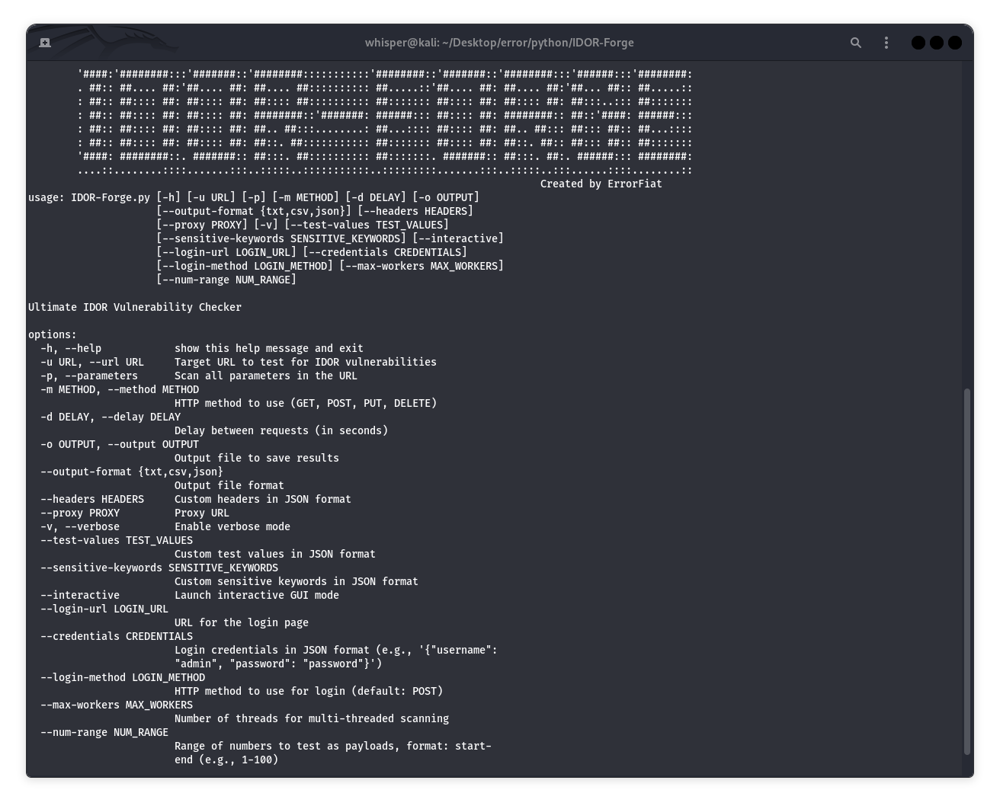
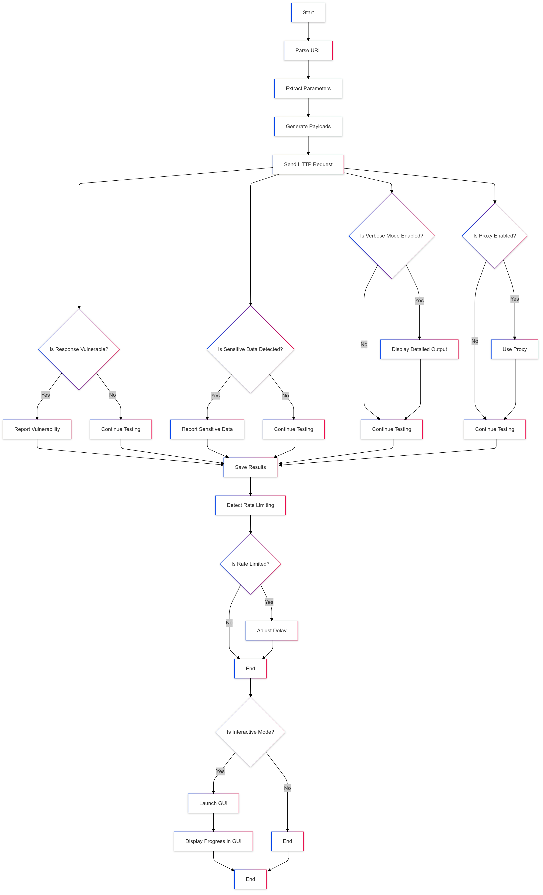
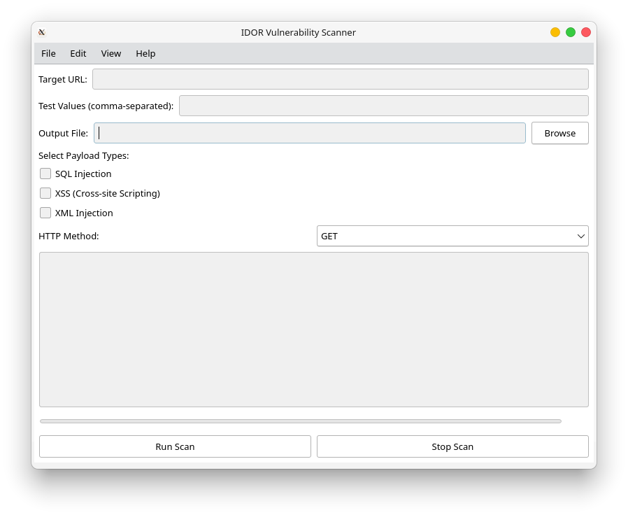
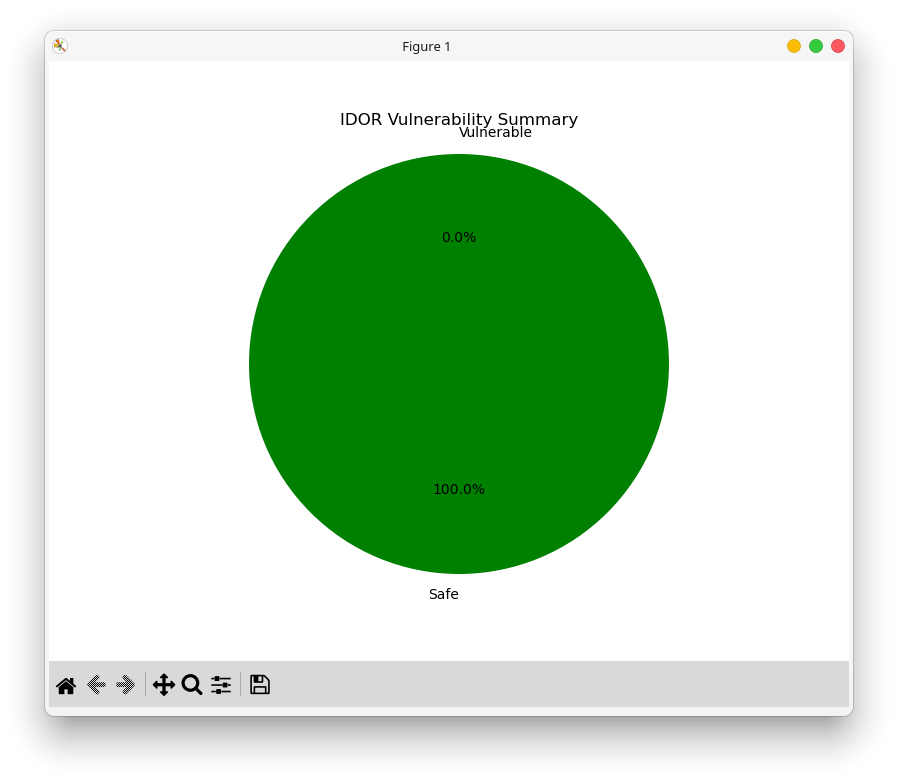

<br/>
<p align="center">
  <a href="https://github.com/errorfiathck">
    
  </a>

  <h3 align="center">IDOR-Forge</h3>

  <p align="center">
        IDOR Forge is a powerful and versatile tool designed to detect Insecure Direct Object Reference (IDOR) vulnerabilities in web applications.
    <br/>
        Note this project is not done...
    <br/>
    <br/>
    <!-- <a href="https://readme.shaankhan.dev"><strong>View Demo »</strong></a> -->
    <br/>
    <br/>
    <a href="https://intsagram.com/error._.fiat">Instagram page</a>
    .
    <a href="https://youtube.com/error_fiat">Youtube chanel</a>
    .
    <a href="https://twitter.com/ErrorFiat">Twitter page</a>
    .
    <a href="https://t.me/hack_authenticator">Telegram chanel</a>
  </p>
</p>

# IDOR Forge: Advanced IDOR Vulnerability Scanner 🕵️‍♂️

> Overview

IDOR Forge is a powerful and versatile tool designed to detect Insecure Direct Object Reference (IDOR) vulnerabilities in web applications. IDOR vulnerabilities occur when an application exposes direct references to internal objects (e.g., database keys, file paths) without proper authorization checks, allowing attackers to access unauthorized data. This tool automates the process of identifying such vulnerabilities by dynamically generating and testing payloads, analyzing responses, and reporting potential issues.




## Flowchart 💾



## Features ✨

- Dynamic Payload Generation: Tests a wide range of inputs, including numeric values, random strings, and special characters.

- Multi-Parameter Scanning: Scans all parameters in a URL for potential IDOR vulnerabilities.

- Support for Multiple HTTP Methods: Tests IDOR vulnerabilities using GET, POST, PUT, and DELETE requests.

- Concurrent Scanning: Uses multi-threading to speed up the scanning process.

- Rate Limiting Detection: Automatically detects and handles rate limiting.

- Customizable Test Values: Allows users to specify custom test values for targeted testing.

- Sensitive Data Detection: Detects sensitive information in responses using customizable keywords.

- Proxy Support: Supports the use of proxies for testing through tools like Burp Suite or OWASP ZAP.

- Interactive GUI Mode: Provides a user-friendly graphical interface for real-time testing.

- Verbose Mode: Displays detailed output for debugging and analysis.

- Output Options: Saves results in TXT or CSV format for easy analysis and reporting.

- Custom Headers: Allows users to add custom headers (e.g., authentication tokens) for testing authenticated endpoints.

- Session Handling: Uses persistent sessions to maintain cookies and authentication states during testing.

## Installation 🛠️

Basic Mode: Displays a summary of captured packets, including:

Prerequisites
- Python 3.7 or higher.

- Required libraries: requests, tkinter, concurrent.futures.

Installation Steps
- Clone the repository:
```
git clone https://github.com/errorfiathck/IDOR-Forge.git
cd IDOR-Forge
```
Install the required dependencies:
```
pip install -r requirements.txt
```
## Usage 🚀
Command-Line Interface (CLI)
Basic Usage
```
python IDOR-Forge.py -u "https://example.com/api/resource?id=1"
```
Advanced Usage
```
python IDOR-Forge.py -u "https://example.com/api/resource?id=1" -p -m GET --proxy "http://127.0.0.1:8080" -v -o results.csv --output-format csv
```
```
python IDOR-Forge.py -u http://example.com/resource?id=1 -p -m GET --output results.csv --output-format csv --test-values [100,200,300] --sensitive-keywords ["password", "email"]
```
```
python IDOR-Forge.py -u http://example.com/api/user?id=1 --parameters -m GET -d 2 -o results.json --output-format json --headers '{"Authorization": "Bearer token"}' --test-values '[1, 2, 3]' --sensitive-keywords '["password", "email"]' -v -Rv
```
Options
- -u, --url: Target URL to test for IDOR vulnerabilities.

- -p, --parameters: Scan all parameters in the URL.

- -m, --method: HTTP method to use (GET, POST, PUT, DELETE).

- -d, --delay: Delay between requests (in seconds).

- -o, --output: Output file to save results.

- --output-format: Output file format (txt or csv).

- --headers: Custom headers in JSON format (e.g., '{"Authorization": "Bearer token"}').

- --proxy: Proxy URL (e.g., http://127.0.0.1:8080).

- -v, --verbose: Enable verbose mode for detailed output.

- --test-values: Custom test values in JSON format (e.g., '[1, 2, 3, 4, 5]').

- --sensitive-keywords: Custom sensitive keywords in JSON format (e.g., '["password", "email"]').

- --interactive: Launch interactive GUI mode.
  
- -Rv, --report-and-visualize: Enable reporting and visualization

- --num-range: Range of numbers to test as payloads, format: start-end (e.g., 1-100)

## Interactive GUI Mode
```
python IDOR-Forge.py --interactive
```


The GUI allows you to input:

- Target URL
- Test values (comma-separated values to test)
- Output file location
- Start/Stop scanning
- Progress indicator
- Live results display

## Example of Running the GUI:

- URL: http://example.com/resource?id=1
- Test Values: 1,2,3,4,5
- Output File: results.json
Click "Run Scan" to start testing. You can also stop the scan at any time using the "Stop Scan" button.

## Advanced Features 🥷🏼

Payload Types:
The following advanced payloads are used to test various attack vectors:

- Random String
- Random Number
- Special Characters
- UUID
- Base64 Encoding
- SQL Injection
- XSS (Cross-Site Scripting)
- File Path Traversal
- Command Injection
- LDAP Injection
- Buffer Overflow
- And more...
  
Detecting Sensitive Data:
The tool checks for the presence of sensitive data, including:

- Passwords
- Tokens
- SSNs
- Credit Card Numbers
- Email addresses

Rate Limiting Detection:

If rate limiting is detected (e.g., HTTP status code 429), the tool automatically adjusts the request delay to avoid further blocking.

## Output Example 📄

Terminal Output (Verbose Mode):
```
Scanning parameter: id
Testing payload: {'id': 1}
Status Code: 200
Response Content: {"data": "sensitive_data"}...
Sensitive data detected!
----------------------------------------
Testing payload: {'id': 2, 'random_str': 'aBcDeFgHiJ'}
Status Code: 403
Response Content: {"error": "Forbidden"}...
----------------------------------------
```

Scan Summary:
```
Scan Summary:
Total Payloads Tested: 10
Vulnerabilities Found: 2
Vulnerable Payloads:
- {'id': 1, 'random_str': 'aBcDeFgHiJ'}
- {'id': 3, 'sql_injection': "' OR '1'='1"}
```
Table:
```
+-------------------+-------------+---------------------------+
|      Payload      | Status Code | Sensitive Data Detected   |
+-------------------+-------------+---------------------------+
| {'id': '1'}       | 200         | True                      |
| {'id': '2'}       | 404         | False                     |
| {'id': '3'}       | 200         | False                     |
+-------------------+-------------+---------------------------+
```
File Output (results.csv):
```
Payload,Status Code,Response Content,Sensitive Data Detected
"{'id': 1}",200,"{"data": "sensitive_data"}",True
"{'id': 2, 'random_str': 'aBcDeFgHiJ'}",403,"{"error": "Forbidden"}",False
```

Pie Chart :




## Contributing 🤝

Contributions are welcome! Please follow these steps:

- Fork the repository.

- Create a new branch for your feature or bug fix.

- Submit a pull request with a detailed description of your changes.

## Why Choose IDOR Hunter? ❓

- Comprehensive Testing: Covers a wide range of payloads and scenarios.

- User-Friendly: Offers both CLI and GUI modes for flexibility.

- Efficient: Uses concurrent scanning to save time.

- Customizable: Allows users to tailor the tool to their specific needs.

## Support 💬

If you encounter any issues or have questions, feel free to open an issue on GitHub or contact the maintainers.

## Acknowledgments 🙏

- Inspired by the OWASP Top 10 and the need for robust security testing tools.

- Built with ❤️ by [ErrorFiat].
